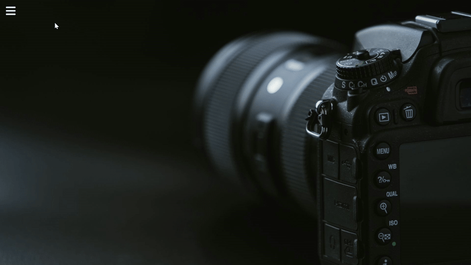

# 📸 CSS Sidebar Navigation — Photography Studio

This is a responsive **sidebar navigation project** built entirely using **HTML and CSS** — no JavaScript involved!

It uses a checkbox toggle trick to show and hide the sidebar, showcasing how CSS alone can handle interactive UI elements.

---

## 🔧 Features

- ✅ Pure HTML & CSS (no JavaScript)
- ✅ Sidebar toggle using the checkbox method
- ✅ Font Awesome icon-based vertical navigation
- ✅ Hover transitions and scaling effects

---

## 💡 Technologies Used

- HTML5  
- CSS3  
- [Google Fonts — Poppins](https://fonts.google.com/specimen/Poppins)  
- [Font Awesome Icons](https://fontawesome.com/)

---

## 🎯 Preview

